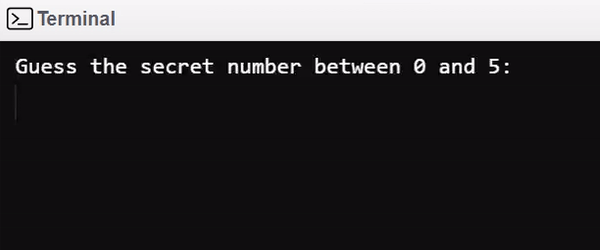

# COMP-2825
Computer Architecture and Organization (COMP 2825)

## Linux System Call Table:
| %eax  | Name |
| ------------- | ------------- |
| 1  | sys_exit  |
| 2  | sys_fork  |
| 3  | sys_read  |
| 4  | sys_write  |
| 5  | sys_open  |
| 6  | sys_close  |
| 13  | sys_time  |

Many more: https://faculty.nps.edu/cseagle/assembly/sys_call.html

